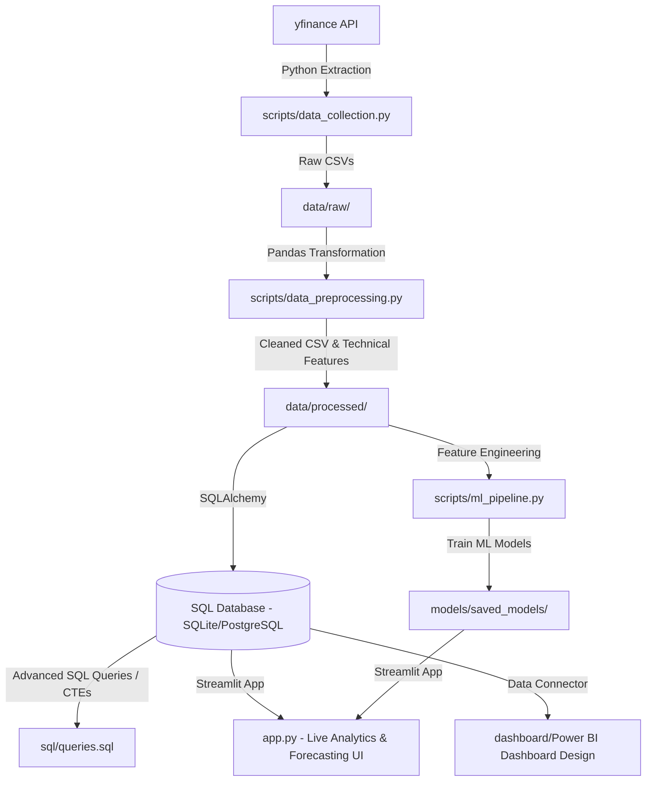

# 📈 Quantum: Real-Time Stock Market Analytics & ML Forecasting Platform

<div align="center">

### End-to-End Financial Analytics, Machine Learning & Business Intelligence System

🚀 Real-Time Data Collection • 📊 Quantitative Analytics • 🤖 ML Forecasting • 🗄️ SQL Analytics • 📈 Interactive Dashboard


</div>

---

## 🌟 Overview

Quantum is a production-grade stock market analytics and forecasting platform that combines **Data Engineering**, **Quantitative Finance**, **Machine Learning**, and **Business Intelligence** into a single end-to-end solution.

The system automatically extracts real-time and historical stock market data, performs advanced financial calculations, stores processed data in a relational SQL database, trains predictive machine learning models, and delivers insights through an interactive Streamlit dashboard.

---

## 🛠️ Tech Stack & Architecture



*   **Language**: Python (Pandas, NumPy, Scikit-learn, SQLAlchemy, Joblib, Streamlit, Plotly, Matplotlib, Seaborn)
*   **Database**: SQLite (Local Dev - Zero Setup) / Fully compatible with MySQL & PostgreSQL (Production)
*   **BI Visualizer**: Power BI (Relational Star Schema Model, Widescreen 16:9 Dark Mode, Custom DAX Calculations)
*   **APIs**: `yfinance` (Intraday & Historical Data Extraction)

---

## ✨ Key Features

### 📊 Real-Time Market Analytics

* Live stock data extraction using Yahoo Finance
* Historical market data analysis
* Multi-stock comparison
* Portfolio performance tracking

### 🧮 Quantitative Finance Indicators

* Daily Returns
* Volatility Analysis
* Simple & Exponential Moving Averages
* Relative Strength Index (RSI)
* MACD
* Bollinger Bands
* Sharpe Ratio

### 🤖 Machine Learning Forecasting

* Next-day stock price prediction
* Feature engineering pipeline
* Time-series aware validation
* Multiple regression models
* Automated model training & persistence

### 🗄️ SQL Analytics

* Star Schema Database Design
* Window Functions
* Common Table Expressions (CTEs)
* Performance Analytics Queries
* Portfolio Metrics Calculation

### 📈 Interactive Dashboard

* Streamlit-based UI
* Dynamic stock selection
* Technical indicator visualization
* Forecasting insights
* Interactive Plotly charts

---

## 🏗️ System Architecture

```text
Yahoo Finance API
        │
        ▼
 Data Collection Layer
        │
        ▼
 Data Preprocessing & Feature Engineering
        │
        ▼
 SQL Database (SQLite/PostgreSQL)
        │
 ┌──────┴──────┐
 ▼             ▼
ML Pipeline   SQL Analytics
 │             │
 └──────┬──────┘
        ▼
 Streamlit Dashboard
```

---

## 🛠️ Tech Stack

### Programming & Analytics

* Python
* Pandas
* NumPy

### Machine Learning

* Scikit-Learn
* Joblib

### Visualization

* Plotly
* Matplotlib
* Streamlit

### Database

* SQLite
* PostgreSQL
* SQLAlchemy

### Data Source

* Yahoo Finance API (`yfinance`)

---

## 📂 Project Structure

```text
Quantum/
│
├── data/
│   ├── raw/
│   └── processed/
│
├── notebooks/
│   └── eda_notebook.ipynb
│
├── scripts/
│   ├── data_collection.py
│   ├── data_preprocessing.py
│   ├── db_integration.py
│   ├── indicators.py
│   └── ml_pipeline.py
│
├── sql/
│   ├── schema.sql
│   └── queries.sql
│
├── dashboard/
│
├── models/
│   └── saved_models/
│
├── images/
│
├── app.py
├── main.py
├── requirements.txt
└── README.md
```

---

## 📊 Technical Indicators Implemented

| Indicator       | Purpose                       |
| --------------- | ----------------------------- |
| Daily Return    | Momentum Analysis             |
| SMA             | Trend Detection               |
| EMA             | Recent Trend Strength         |
| RSI             | Overbought/Oversold Detection |
| MACD            | Trend Reversal Analysis       |
| Bollinger Bands | Volatility Analysis           |
| Sharpe Ratio    | Risk-Adjusted Return          |

---

## 🧠 Machine Learning Pipeline

### Workflow

1. Data Collection
2. Data Cleaning
3. Feature Engineering
4. Target Creation
5. Time-Series Split
6. Model Training
7. Evaluation
8. Model Serialization
9. Live Prediction

### Models Used

* Linear Regression
* Random Forest Regressor
* Gradient Boosting Regressor

### Engineered Features

* Price Lags
* Volume Lags
* Rolling Returns
* Rolling Volatility
* Technical Indicators

---

## 📈 SQL Analytics Portfolio

The project includes advanced SQL queries demonstrating:

* Joins
* Aggregations
* Window Functions
* Common Table Expressions
* Ranking Functions
* Rolling Calculations

### Example Analytics

* Month-over-Month Growth
* Rolling Moving Averages
* Volume Spike Detection
* Top Performing Stocks
* RSI-Based Signal Generation

---

## 🚀 Installation

### Clone Repository

```bash
git clone https://github.com/Hardik7224/Quantum-Stock-Analytics.git
cd Quantum-Stock-Analytics
```

### Install Dependencies

```bash
pip install -r requirements.txt
```

### Run ETL Pipeline

```bash
python main.py
```

### Launch Dashboard

```bash
streamlit run app.py
```

Open:

```text
http://localhost:8501
```

---

## 🎯 Skills Demonstrated

### Data Engineering

* ETL Pipelines
* Data Validation
* Data Transformation
* Workflow Automation

### Data Analytics

* Exploratory Data Analysis
* Financial KPIs
* Statistical Analysis

### Machine Learning

* Forecasting
* Feature Engineering
* Model Evaluation
* Time-Series Validation

### SQL

* Database Design
* Query Optimization
* CTEs
* Window Functions

### Business Intelligence

* Dashboard Development
* Data Visualization
* KPI Monitoring

---

## 📊 Project Metrics

* 📈 5+ Years Historical Market Data
* 📊 10+ Financial Indicators
* 🤖 3 Machine Learning Models
* 🗄️ Relational SQL Database
* 📉 Automated Forecasting Pipeline
* 🚀 Real-Time Analytics Dashboard

---

## 🔮 Future Enhancements

* Deep Learning Models (LSTM/GRU)
* Sentiment Analysis from Financial News
* Real-Time Streaming Data
* Portfolio Optimization Engine
* Cloud Deployment
* Multi-Market Support
* Automated Trading Signal Generation

---
