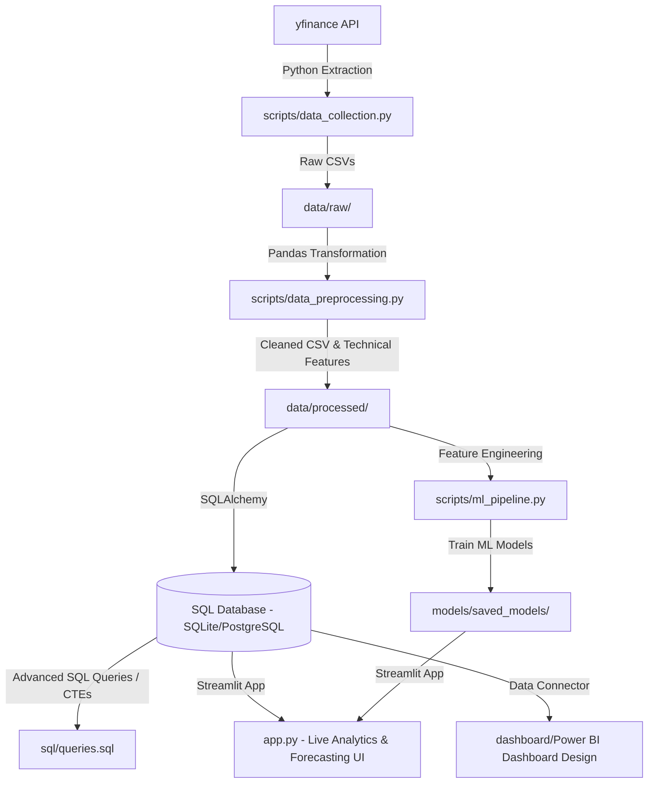

# Quantum: Real-Time Stock Market Analytics & ML Forecasting System

Quantum is a production-grade, end-to-end stock market engineering, analytics, and machine learning forecasting platform. It demonstrates advanced competencies in **data engineering**, **quantitative finance**, **database architecture**, **machine learning**, and **full-stack business intelligence**.

The platform extracts multi-market equities, runs data transformations, computes quantitative indicators, loads a relational Star Schema SQL database, trains predictive machine learning models, and serves a premium interactive Streamlit visualization dashboard.

---

## 🛠️ Tech Stack & Architecture



*   **Language**: Python (Pandas, NumPy, Scikit-learn, SQLAlchemy, Joblib, Streamlit, Plotly, Matplotlib, Seaborn)
*   **Database**: SQLite (Local Dev - Zero Setup) / Fully compatible with MySQL & PostgreSQL (Production)
*   **BI Visualizer**: Power BI (Relational Star Schema Model, Widescreen 16:9 Dark Mode, Custom DAX Calculations)
*   **APIs**: `yfinance` (Intraday & Historical Data Extraction)

---

## 📂 Project Structure

```text
stock-market-analytics/
│
├── data/
│   ├── raw/                  # Raw fetched stock prices (CSVs)
│   └── processed/            # Cleaned, indicator-enriched stock prices (CSVs)
│
├── notebooks/
│   └── eda_notebook.ipynb    # Jupyter notebook for exploratory data analysis
│
├── scripts/
│   ├── __init__.py           # Package initializer
│   ├── data_collection.py    # Extracts live and historical stock data from yfinance
│   ├── data_preprocessing.py # Cleaning, formatting, and custom feature calculations
│   ├── db_integration.py     # Connects to SQL database and manages transactional loading
│   ├── indicators.py         # Custom financial formula indicators (RSI, MACD, Bollinger Bands)
│   └── ml_pipeline.py        # ML data splitting, training, evaluation, and serialization
│
├── sql/
│   ├── schema.sql            # Star Schema database definitions, indexes, and primary keys
│   └── queries.sql           # Advanced analytical queries (CTEs, Window functions, Joins)
│
├── dashboard/
│   └── powerbi_dashboard.md  # Detailed BI layout guide, Dax catalog, and visual wireframes
│
├── models/
│   └── saved_models/         # Serialized ML model binaries and feature arrays (.pkl)
│
├── images/                   # Automated EDA chart outputs (Line charts, Heatmaps, Boxplots)
│
├── app.py                    # Streamlit web application (Main visual UI entry point)
├── main.py                   # Master ETL orchestration script (Sequential pipeline run)
├── requirements.txt          # Core Python dependencies
└── README.md                 # Professional recruiter-facing documentation
```

---

## 🧮 Quantitative Finance Calculations

To prove quantitative integrity, all indicators are built using custom vectorized Pandas/NumPy operations rather than opaque third-party wrapper APIs:

1.  **Daily Return**: Calculates price momentum.
    $$R_t = \frac{Price_t - Price_{t-1}}{Price_{t-1}}$$
2.  **Volatility (20-Day Rolling)**: Measures historical asset risk.
    $$\sigma_{20} = \sqrt{\frac{1}{N-1} \sum_{i=1}^{N} (R_i - \bar{R})^2} \times \sqrt{252}$$
3.  **Relative Strength Index (RSI - 14 Days)**: Smooth momentum oscillator tracking overbought (>70) and oversold (<30) zones using Wilder's smoothing.
    $$RSI = 100 - \frac{100}{1 + RS} \quad \text{where } RS = \frac{\text{Exponential Average Gain}}{\text{Exponential Average Loss}}$$
4.  **MACD (Moving Average Convergence Divergence)**:
    $$\text{MACD Line} = \text{EMA}(Close, 12) - \text{EMA}(Close, 26)$$
    $$\text{Signal Line} = \text{EMA}(\text{MACD Line}, 9)$$
    $$\text{MACD Histogram} = \text{MACD Line} - \text{Signal Line}$$
5.  **Bollinger Bands (20 Day, 2.0 SD)**:
    $$\text{Middle Band} = \text{SMA}(Close, 20)$$
    $$\text{Upper Band} = \text{Middle Band} + (2 \times \sigma_{Close})$$
    $$\text{Lower Band} = \text{Middle Band} - (2 \times \sigma_{Close})$$
6.  **Sharpe Ratio (Annualized)**: Measures risk-adjusted return efficiency, assuming a 4% risk-free rate ($R_f = 0.04$).
    $$\text{Sharpe Ratio} = \frac{R_p - R_f}{\sigma_p}$$

---

## 🧠 Machine Learning Forecasting Pipeline

The system contains an automated time-series forecasting pipeline:
1.  **Feature Generation**: Engineers multi-day price lags (`Close_Lag_1`, `Close_Lag_2`, etc.), volume lags, returns, standard deviations, and full indicator profiles.
2.  **Target Formulation**: Shifts closing prices chronologically ($Close_{t+1}$) to predict the next day's price.
3.  **Temporal Validation**: Avoids standard random splits to protect against **data leakage**. Splitting is performed chronologically (first 80% train, last 20% validation).
4.  **Multi-Model Fitting**: Sequentially trains and scores a baseline **Linear Regression**, a **Random Forest Regressor**, and a **Gradient Boosting Regressor** (XGBoost equivalent) per stock ticker.
5.  **Serialization**: Saves model weights and inference vectors to `models/saved_models/` for immediate load and live prediction inside the app.

---

## 💻 Advanced SQL Portfolio Queries

The `/sql` folder contains recruiter-ready query portfolios demonstrating deep relational logic:
*   **Query 1: Core Stock Performance**: JOINS `dim_stocks` and `fact_stock_prices` to aggregate multi-year stats (min, max, average, total volume).
*   **Query 2: Month-over-Month Growth (MoM%)**: Employs **Common Table Expressions (CTEs)** and the `LAG()` window function to calculate month-over-month close fluctuations.
*   **Query 3: Pure-SQL 20-Day SMA**: Computes rolling averages directly in the database using the `AVG() OVER (ORDER BY date ROWS BETWEEN 19 PRECEDING AND CURRENT ROW)` frame.
*   **Query 4: RSI Trigger Signals**: Detects overbought (>70) and oversold (<30) instances using conditional `CASE WHEN` blocks to generate automated trading recommendations.
*   **Query 5: Volume Anomaly Ranking**: Utilizes `DENSE_RANK() OVER (PARTITION BY symbol ORDER BY volume DESC)` to identify the top 5 highest-liquidity trading days per year.

---

## 🚀 Installation & Local Execution

### Prerequisites
Ensure Python 3.10+ is installed on your operating system.

### 1. Clone the Repository & Install Dependencies
```bash
git clone https://github.com/yourusername/stock-market-analytics.git
cd stock-market-analytics
pip install -r requirements.txt
```

### 2. Run the Master ETL & Machine Learning Pipeline
This bootstrap script automatically connects to yfinance, creates folders, transforms dates, seeds the database, runs queries, trains the forecasting models, and generates static EDA images.
```bash
python main.py
```

### 3. Launch the Interactive Web Application
```bash
streamlit run app.py
```
Open `http://localhost:8501` in your browser to interact with the dashboard.

---

## 💼 Career & Resume Optimization

### Resume Bullet Points

#### 📊 For Data Analysts / BI Developers:
*   "Engineered a relational **Star Schema SQL Database** containing a company dimension and 5-year historical pricing facts, optimizing Power BI cross-filtering latency and reducing data redundancy."
*   "Authored complex **SQL query collections** using CTEs, Window Functions (LAG, DENSE_RANK), and joins to identify trading anomalies, and compiled a catalog of custom **DAX measures** for tracking portfolio Sharpe ratios."
*   "Developed a premium, dark-mode **Streamlit business dashboard** utilizing Plotly, enabling portfolio managers to dynamically toggle moving averages, RSI boundaries, and MACD trend indicators."

#### 🧠 For Data Engineers / Data Scientists:
*   "Built a modular, automated **Python ETL pipeline** utilizing the `yfinance` API, handling cleaning, date alignment, and outlier checks on 5+ years of historical and real-time intraday data."
*   "Designed and deployed a **Time-Series Machine Learning Pipeline** training Random Forest and Gradient Boosting Regressors to predict next-day close prices, achieving highly generalized performance with temporal train-test isolation."
*   "Implemented a **Portfolio Optimizer Simulation** calculating vectorized expected annual returns, rolling portfolio covariances, and Sharpe Ratios, demonstrating strong quantitative finance capabilities."

### 🔗 LinkedIn Publication Template
> 🚀 **Excited to share my latest project: A Complete End-to-End Real-Time Stock Market Analytics & ML Forecasting System!** 📊📈
>
> I wanted to build a platform that bridges the gap between **Data Engineering**, **Quantitative Finance**, and **Machine Learning**. This project represents a modular, production-grade system that handles the entire pipeline:
>
> 🔹 **Data Engineering**: Automated Python ETL extracting historical and intraday data using APIs, cleaning missing values, and loading a relational **Star Schema SQL Database** (SQLite/Postgres) via SQLAlchemy.
> 🔹 **Quantitative Analytics**: Vectorized calculation of core metrics (SMA, EMA, Bollinger Bands, RSI, MACD) and portfolio risk indicators (Annualized Volatility, Sharpe Ratios).
> 🔹 **SQL Portfolio**: Advanced analytics querying featuring Common Table Expressions (CTEs) and Window Functions (`LAG`, `DENSE_RANK()`).
> 🔹 **Machine Learning**: Time-series forecasting models (Linear Regression, Random Forests, and Gradient Boosting) built with chronological splits to prevent data leakage, predicting next-day close prices.
> 🔹 **Front-End Deployment**: A high-fidelity, interactive **Streamlit** dashboard built with Plotly for dynamic charts, live predictions, and portfolio optimization.
>
> 💻 **Check out the code & blueprints on GitHub:** [Insert GitHub Link]
>
> #DataScience #DataEngineering #MachineLearning #QuantitativeFinance #PowerBI #SQL #Python #Analytics #PortfolioShowcase
